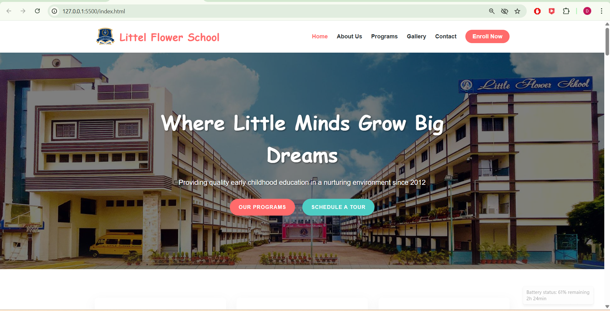
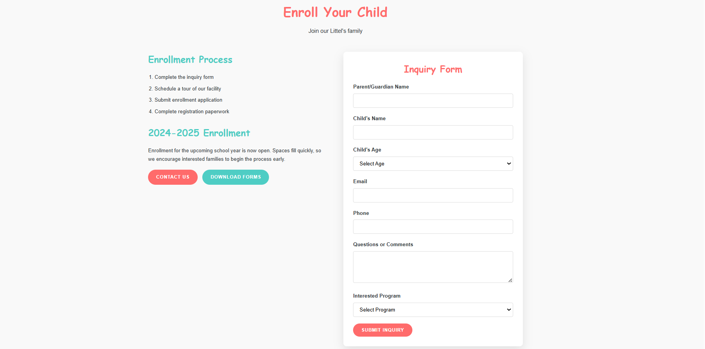
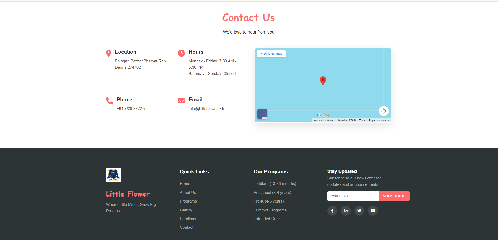

# **Pre-School-Task** 

**Pre-School Task Project 🎨📚**

This is a simple Pre-School Task Project created using HTML, CSS, and JavaScript.
The project is designed to be colorful, interactive, and easy for children to understand and use.

**✨ Features**

🎨 Child-friendly and attractive UI

🧒 Easy-to-use interface for pre-school users

📅 Online Appointment Booking

Parents can book appointments online

Simple form-based appointment system

🖼️ Gallery Section

View school activities and events

Displays images in a clean and organized layout

📱 Responsive design for different screen sizes

# 🛠️ Technologies Used

HTML – For structuring the web pages

CSS – For styling and making the UI attractive

JavaScript – For interactivity and logic


# 📁 Project Structure
```bash
/project-folder
│
├── index.html
├── style.css
├── script.js
└── /images
```

# 🚀 How to Run the Project

```bash
Download or clone the project

Open index.html in any modern web browser
```

#  📸 Screenshots

 **Home Page**  


 **Online Appointment Page**  


 **Footer Page**  



# 📌Purpose of the Project

This project is developed as part of a Pre-School Task Assignment to demonstrate basic front-end development skills using HTML, CSS, and JavaScript.
